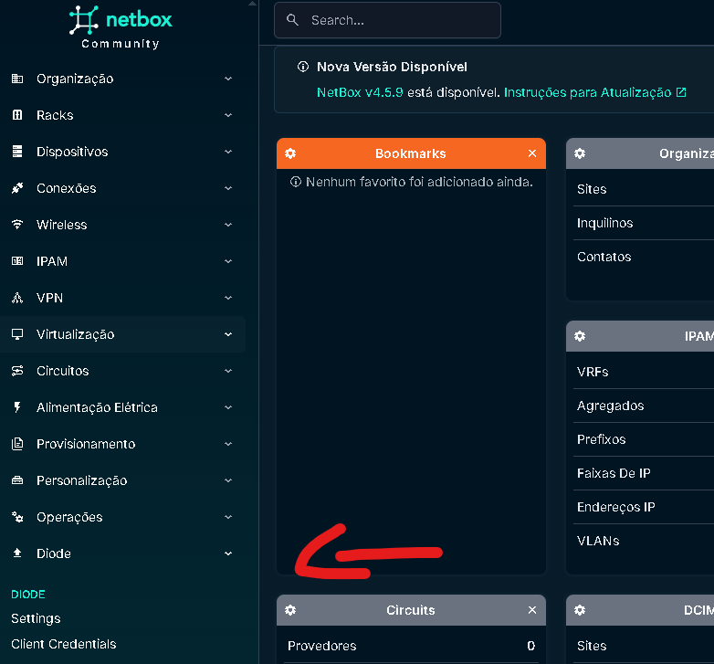

https://chat.deepseek.com/a/chat/s/59395b4b-ce8b-4b2c-9b57-5b898d9bee43

# Sobre

Plugin do netbox para adicionar de forma automática devices de rede no netbox

---

# Instalação Diode Server

Responsável por receber, processar e reconciliar os dados enviados pelos clientes (scripts ou agentes) e integrá-los ao NetBox. Utilizando protocolos como gRPC, o Diode Server valida as informações recebidas e executa a atualização automatizada do inventário no NetBox por meio da API exposta pelo plugin.

Esse servidor atua como um intermediário inteligente, garantindo que os dados inseridos estejam corretos, completos e sincronizados com os registros existentes.

## Componentes

- Ingester: Receives data from ORB Agent (responsável por receber os dados do agente)
- PostgreSQL: Stores raw network data
- Reconciler: Creates NetBox changesets
- Hydra: OAuth 2.0 authorization server (responsável pelas autenticações oauth)
- Nginx: Reverse proxy

## Data Flow

```
ORB Agent → Ingester → PostgreSQL → Reconciler → NetBox
                           ↓
                        Hydra (Auth)
```

**Referencia: [diode github](https://github.com/netboxlabs/diode)**

1. Instalar pre-requisitos:

```bash
sudo apt-get install jq -y
```

2. Criar os diretórios do diode-server e do orb-agent

```bash
mkdir -p /opt/netbox-discovery/{diode,orb-agent}
```

*obs: o nome do diretório `netbox-discovery` é apenas sugestão*

3. Configurar o Diode Server

```bash
cd /opt/netbox-discovery/diode
# download do arquivos de instalação
curl -sSfLo quickstart.sh https://raw.githubusercontent.com/netboxlabs/diode/release/diode-server/docker/scripts/quickstart.sh

# configure para deixar executável
chmod +x quickstart.sh

# Execute o quick-start apontando para url do netbox
./quickstart.sh http://<hostname_netbox>:<port_netbox>
```

Esse script vai:

- Fazer o download do docker-compose.yml
- Criar um arquivo .env
- Gerar as credenciais de OAuth (entre netbox e diode)

Para visualizar as credenciais OAuth geradas acesse o arquivo

```bash
cat /opt/netbox-discovery/diode/oauth2/client/client-credentials.json
```

4. Iniciar o Diode Server

```bash
cd /opt/netbox-discovery/diode/
#faz um replace no arquivo docker-compose para que em casos de reboot no servidor, ele suba novamente automaticamente.
sed -i -E 's/(restart:[[:space:]]*)on-failure/\1unless-stopped/g' docker-compose.yaml
docker compose up -d

# Verificar status
docker compose ps
```

---

# Instalação Diode Plugin (netbox-docker)

Responsável por receber os dados do DIODE e update NetBox

## Funções

- Pulls changesets from DIODE API
- Creates/updates devices
- Manages interfaces and IP addresses
- Handles OAuth authentication
- Provides UI for credential management

## Arquitetura

```
┌─────────────────┐     ┌─────────────────┐     ┌─────────────────┐
│   ORB Agent     │────▶│  DIODE Server   │────▶│ NetBox Plugin   │
│  (Discovery)    │     │  (Processing)   │     │   (Storage)     │
└─────────────────┘     └─────────────────┘     └─────────────────┘
       │                        │                        │
       │                        │                        │
       ▼                        ▼                        ▼
  SSH/SNMP               PostgreSQL                  NetBox DB
  Devices                   Hydra                     
                          OAuth 2.0
```

1. Dentro do diretório onde está seu docker-compose.yml do NetBox Docker, copie estes três arquivos:

- [plugin_requirements.txt](../../netbox-custom/netbox-diode/plugin_requirements.txt)
- [Dockerfile-Plugins](../../netbox-custom/netbox-diode/Dockerfile-Plugins)
- [docker-compose.override.yml](../../netbox-custom/netbox-diode/docker-compose.override.yml)

```bash
cp /opt/netbox-docker/netbox-custom/netbox-diode/plugin_requirements.txt /opt/netbox-docker/netbox
cp /opt/netbox-docker/netbox-custom/netbox-diode/Dockerfile-Plugins /opt/netbox-docker/netbox
cp /opt/netbox-docker/netbox-custom/netbox-diode/docker-compose.override.yml /opt/netbox-docker/netbox
```

*obs: caso já possua um `docker-compose.override.yml` de instalação do netbox-docker, apenas acrescente as linhas abaixo para instalação dos plugins ao invés de copiar o arquivo:*

```yaml
services:
  netbox:
    build:
      context: .
      dockerfile: Dockerfile-Plugins
    image: netbox-with-diode:latest
  netbox-worker:
    image: netbox-with-diode:latest
    build:
      context: .
      dockerfile: Dockerfile-Plugins
```

2. Configuração do arquivo de plugin

Configurar o arquivo de plugins do Netbox para adicionar o plugin e as credenciais de `client_secret` e `client_id` gerados em `client-credentials.json` (/opt/netbox-discovery/diode/oauth2/client/client-credentials.json) conforme passos anteriores.

```bash
# obtenha as credenciais diode-to-netbox
cat /opt/netbox-discovery/diode/oauth2/client/client-credentials.json | grep -A 3 "netbox-to-diode"
# copie o arquivo de plugins para o diretório do netbox-docker
cp /opt/netbox-docker/netbox-custom/netbox-diode/configuration/plugins.py /opt/netbox-docker/netbox/configuration/plugins.py
# abra o arquivo de plugins e configure as credenciais e o grpc do diode
nano /opt/netbox-docker/netbox/configuration/plugins.py
```

**Exemplo:**

```python
# restante omitido
PLUGINS_CONFIG = {
    "netbox_diode_plugin": {
        "diode_target_override": "grpc://192.168.249.175:8080/diode",
        "diode_username": "diode",
        "client_id": "netbox-to-diode",
        "netbox_to_diode_client_secret": "veVUxfl9reMcOW7gBkNRaT7KoB+Pt72vIadI14bpN4="
    },
}
# restante omitido
```

*obs: diode_targe_override é o grpc do diode, não do netbox*

3. Reconstrua e inicie os containers do netbox-docker

```bash
cd /opt/netbox-docker/netbox/
docker compose build --no-cache
docker compose up -d
docker images | grep netbox
```

Ao executar o comando *docker images | grep netbox* uma nova imagem foi criada com o nome de `netbox-with-diode:latest`. Isso torna o plugin permanente.

4. Validação

Acesse o netbox e confira se o Plugin Diode aparece na interface



---

# Instalação do Orb Agent

**Como funciona:**

- Executado via docker container
- Usa Drivers do Napalm para conectar a multi vendors
- Conecta aos devices via SSH/SNMP/NETCONF
- Schedule discovery configurável
- Envia os dados ao servidor do Diode

- Vendors suportados:
  - Cisco (IOS, IOS-XE, NXOS, IOS-XR)
  - Juniper (JunOS)
  - Arista (EOS)
  - Entre outros via [NAPALM](https://napalm.readthedocs.io/en/latest/support/index.html)

**Referencia: [orb-agent github](https://github.com/netboxlabs/orb-agent)

1. Gerar Credenciais Netbox -> Diode/Orb

Na interface web do NetBox, vá em 'Diode' -> 'Client Credentials' e crie uma nova credencial para o seu agente. Guarde o Client ID e o Client Secret gerados, pois você os usará no arquivo `agent.yaml` do Orb Agent."

2. Configurar o arquivo de agente do Orb. Já existe um arquivo pré-configurado, basta executar os comandos abaixo para copia-lo:

```bash
cp /opt/netbox-docker/netbox-custom/netbox-diode/orb-agent/agent.yaml /opt/netbox-discovery/orb-agent
# abra o arquivo para configura-lo de acordo com o que deseja monitorar
nano /opt/netbox-discovery/orb-agent/agent.yaml
```

3. Configurar o docker do Orb Agent

Já existe um arquivo pré configurado nesse repositório, basta copia-lo e se necessário, customiza-lo de acordo com a necessidade

```bash
cp /opt/netbox-docker/netbox-custom/netbox-diode/orb-agent/docker-compose.yml /opt/netbox-discovery/orb-agent/
```

4. Subir o container do orb agent

```bash
# acessar o diretório do orb-agent
cd /opt/netbox-discovery/orb-agent/
#subir o container
docker compose up -d
```

Para validar, verifique alguns logs:

- validar o container: docker compose ps

- verificar logs do Agent ORB: docker compose logs -f orb-agent

---

# Troubleshooting

- **Verificar status de todos os containers**

```bash
cd /opt/netbox-docker/netbox && docker compose ps
cd /opt/netbox-discovery/diode && docker compose ps
cd /opt/netbox-discovery/orb-agent && docker compose ps
```

- **Listar clients OAuth na Hydra**

```bash
cd /opt/netbox-discovery/diode
docker compose exec hydra hydra list clients --endpoint http://localhost:4445
```

- **Testar token OAuth para o DIODE**

```bash
curl -X POST http://<hostname_diode>:<port>/oauth2/token \
  -d "grant_type=client_credentials" \
  -d "client_id=YOUR_CLIENT_ID" \
  -d "client_secret=YOUR_CLIENT_SECRET"
```

- **verificar saúde da api do DIODE**

```bash
curl http://<hostname_diode>:<port>/health
```

- **Reiniciar todos os serviços**

```bash
cd /opt/netbox-docker/netbox && docker compose restart
cd /opt/netbox-discovery/diode && docker compose restart
cd /opt/netbox-discovery/orb-agent && docker compose restart
```

# Referencias

- Instalação:

  - https://github.com/network-tocoder/AI-Powered-Network-Automation-Series#video-8-netbox-dynamic-inventory---core-concepts-explained
  - https://github.com/network-tocoder/AI-Powered-Network-Automation-Series#video-9-netbox-auto-discovery---complete-setup-guide
  - https://www.youtube.com/watch?v=nD9FeG8A44o&t=81s
  - https://www.youtube.com/watch?v=DODzEsMTmKQ

- Orb Agent:

  - https://github.com/netboxlabs/orb-agent
  - https://deepwiki.com/netboxlabs/orb-agent/2.2-quick-start-configuration
  - https://netboxlabs.com/docs/orb-agent/config_samples/

- Diode:

  - https://netboxlabs.com/docs/diode/getting-started/
  - https://netboxlabs.com/docs/discovery/getting-started/
  - https://github.com/netboxlabs/diode/blob/develop/GET_STARTED.md
  - https://github.com/netboxlabs/diode
