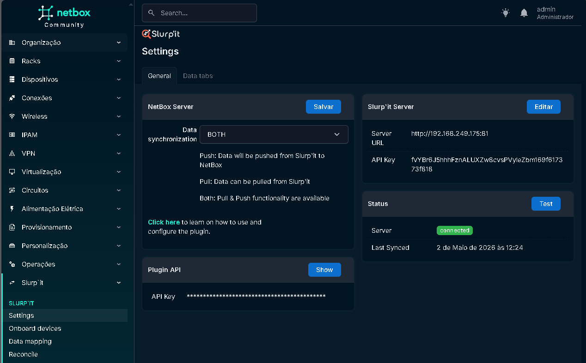

# Sobre

Slurp'it é uma ferramenta de solução de discovery de redes. 

---

# Como o Slurpit funciona

- Portal
  - Interface GUI
  - Rest API
  - SQL DataBase

- Warehouse
  - armazenamento de toda a coleta raw em um MongoDB

- Scanner
  - Container para encontrar os devices e Crawler, usando snmp e scanner na camada L2 e L3

- Scraper
  - Container do serviço de data collector que usa templates do portal para coletar os devices e armazenar na estrutura do Warehouse.

> Referencia: [Slurp'it architecture](https://slurpit.io/knowledge-base/architecture/)

---

# ⚠️ Pré-requisitos

- CPU Cores 8
- RAM 16
- Storage: 250GB SSD

> Referencia: [Slurp'it system requirements](https://slurpit.io/knowledge-base/slurpit-system-requirements/)

---

# Instalação Slurpit

> Referencia: [How to install Slurpit Using Docker](https://www.youtube.com/watch?v=Asji7fTfCy8&list=PLxv8A8sCq4EAyEIL6FnEMLdUc83gGsF4c&index=3)

1. Clone o repositório do Slurp'it Network Discovery

```bash
git clone https://gitlab.com/slurpit.io/images.git /opt/slurpit-docker
```

2. Configurar o arquivo docker compose override

```yaml
cat <<EOF > /opt/slurpit-docker/docker-compose.override.yml
services:
  slurpit-mariadb:
    environment:
      TZ: America/Sao_Paulo
    # ports:
    #   - "3306:3306"

  slurpit-mongodb:
    environment:
      TZ: America/Sao_Paulo
    # ports:
    #  - "27017:27017"

  slurpit-warehouse:
    image: slurpit/warehouse:latest
    environment:
      TZ: America/Sao_Paulo
      WAREHOUSE_PORTAL_URL: http://slurpit-portal
    # ports:
    #  - "80:80"
    #  - "50051:50051"

  slurpit-scraper:
    image: slurpit/scraper:latest
    environment:
      TZ: America/Sao_Paulo
      SCRAPER_TIMEOUT: 60
      SCRAPER_COMMAND_TIMEOUT: 120
      SCRAPER_POOLSIZE: 16

  slurpit-scanner:
    image: slurpit/scanner:latest
    environment:
      TZ: America/Sao_Paulo
      SCANNER_POOLSIZE: 16
      SCANNER_SNMP_TIMEOUT: 20
      # SMART IP Discovery will try to get the real management IP
      # https://slurpit.io/knowledge-base/smart_ip_discovery/
      SCANNER_SMART_IP_DISCOVERY: true
      # https://slurpit.io/knowledge-base/fine-tune-the-device-finder
      # SCANNER_ICMP_ENABLED: false
      # SCANNER_ARP_ENABLED: false
      # SCANNER_TCP_ENABLED: true
      # SCANNER_TCP_PORTS: '[22,23]'

  slurpit-retriever:
    image: slurpit/retriever:latest
    environment:
      TZ: America/Sao_Paulo
      RETRIEVER_POOLSIZE: 8

  slurpit-portal:
    image: slurpit/portal:latest
    environment:
      TZ: America/Sao_Paulo
      PORTAL_BASE_URL: http://localhost:81
      PORTAL_MENU_MODE: shortcuts
    ports:
      - "81:80"
      - "443:443"
EOF
```

3. Subir o container

```bash
cd /opt/slurpit-docker
bash up.sh
```

4. Validação

Validar que todos os containers subiram com 

```bash
docker compose ps
```

Se todos estiverem ativos, acessar o portal através da url http://<ip_do_seu_servidor>:81

Usuário: admin
Senha: 12345678

---

# Configuração Slurpit

## Credenciais

- Acessar o Portal do Slurpit
- Admin > Vault
- Configurar as credenciais de SSH e SNMP

## Configurar o Discovery

- Acessar o Portal do Slurpit
- Inventory > Devices
- Acessar a aba Device Finder > Finder
- Configurar como será feito o discovery
- Iniciar o start do scanner

---

# Instalação Slurpit Plugin Netbox

1. Siga o procedimento de instalação do netbox com docker conforme documentação em [README.md](../../../README.md)

2. Copie os arquivos customizados abaixo para instalação do plugin Slurpit para o netbox

```bash
# copiar o arquivo de plugins com o plugin do slurpit
cp /opt/netbox-docker/netbox-custom/netbox-slurpit/configuration/plugins.py /opt/netbox-docker/netbox/configuration/plugins.py
cp /opt/netbox-docker/netbox-custom/netbox-slurpit/plugin_requirements.txt /opt/netbox-docker/netbox
# copiar os arquivos de docker costumizados
cp /opt/netbox-docker/netbox-custom/netbox-slurpit/Dockerfile-Plugins /opt/netbox-docker/netbox
cp /opt/netbox-docker/netbox-custom/netbox-slurpit/docker-compose.override.yml /opt/netbox-docker/netbox
```

3. Reconstrua e inicie os containers do netbox-docker

```bash
cd /opt/netbox-docker/netbox/
docker compose build --no-cache
docker compose up -d
docker images | grep netbox
```

## Configuração do Slupirt para Netbox

No Netbox, vá em Slurp'it > settings
Configure como achar melhor a forma como será feita a sincronização



---

# Troubleshooting

- **Verificar status de todos os containers**

```bash
cd /opt/slurpit-docker/ && docker compose ps
```

- **Verificar logs de todos os containers**

```bash
cd /opt/slurpit-docker/ && docker compose logs -f
```

# Referencias

- https://deepwiki.com/ottocoster/slurpit-netbox-netpicker
- [Slurp'it - Training Videos](https://www.youtube.com/playlist?list=PLxv8A8sCq4EAyEIL6FnEMLdUc83gGsF4c)
- [Netbox Tutorial - Slurp'it Plugin Introduction](https://www.youtube.com/watch?v=LBVChK1IrzU&list=PLxv8A8sCq4EB9dFQGOTd2OJlS3Dv9Ddi6)